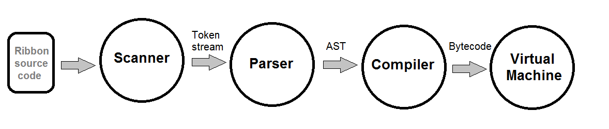

# The Ribbon programming language

Ribbon is a dynamic interpreted programming language. It's inspired by the likes of Python, Javascript and a little bit of Lua.

Here is a Fizzbuzz implementation to get a look and feel for Ribbon:

```Python
Numbers = class {
    @init = {
        self.n = 0
    }

    next = {
        n = self.n
        self.n += 1
        return n
    }
}

fizzbuzz = { | max |
  numbers = Numbers()

  n = numbers.next()
  while n < max {
    if n % 3 == 0 and n % 5 == 0{
      print("fizzbuzz")
    } elsif n % 3 == 0 {
      print("fizz")
    } elsif n % 5 == 0 {
      print("buzz")
    } else {
      print(n)
    }

    n = numbers.next()
  }
}

fizzbuzz(20)
```

The Ribbon language guide can be found [here](docs/guide.md).

### Ribbon high level architecture



As illustrated above, the processing of a Ribbon program goes through the following main modules of the interpreter:

* **Scanner**: converts the user's source code into a stream of meaningful tokens
* **Parser**: parses the stream of tokens into an Abstract Syntax Tree - a hierarchical tree representing the program structure
* **Compiler**: compiles the AST into a linear sequence of bytecode instructions 
* **VM**: iterates over the bytecode instructions and executes them one by one. The VM also includes the garbage collector, among additional facilities of the interpreter
  
There are additional modules at play which are mainly used by the primary modules. One such example example would be the **Memory** module. It manages memory allocations and may alert in case of a native memory leak. 

### The main traits of Ribbon:

* Multi-paradigm: has classes and methods alongside closures and first class functions
* Everything is an expression - including classes and functions
* Extensible through the C extension system
* Minimal syntax, no ceremony or boilerplate
* 2D graphics programming supported out of the box via a standard library module
* Comprehensive test suite for the interpreter

### How to install Ribbon:

In order to install Ribbon we first need to build it from source.

After building Ribbon, it can be easily distributed and installed as a self contained directory, containing the interpreter `ribbon.exe` with the standard library `stdlib\` next to it.

#### Requirements to run Ribbon:

* Ribbon currently only runs on Windows 64 bit

#### Requirements to build Ribbon:

* Mingw-w64 GCC for building the interpreter, visible on `PATH` as `gcc`
* Python 3 for running the test suite of the interpreter, visible on `PATH` as `python`
* **Optional:** in order to build the included `graphics` standard library module, we need the SDL2 library installed. More on this later

#### Steps to build Ribbon:

1. Clone this repository

2. `CD` to the root directory of the repo

3. Set environment variables required for building the interpreter:
    * Point `RIBBON_BUILD_INCLUDE` to the directory of the C libraries header files (For example: `C:/msys64/mingw64/include`)
    * Point `RIBBON_BUILD_LIB` to the directory of the C libraries binaries (For example: `C:/msys64/mingw64/lib`)

4. Run `build_dev.bat` in order to build in development mode. This turns on several diagnostics, and is necessary for the tests to pass.
   After building, the development output binary `ribbon.exe` will be located at `src\ribbon.exe`.

        > build_dev.bat
  
5. Ribbon comes with a dummy C module which is used in the test suite for the extension system. Build it from the current directory by running

        > src\sample_extension\bdeploy.bat
          
6. Run the test suite for the Ribbon interpreter:

        > test.bat
        
    You should see all of the tests passing.
    
7. Now we can build Ribbon for release. After building, this copies `ribbon.exe` and the adjacent `stdlib` directory, from `src` to a specified installation directory. If unspecified, the default is `release\ribbon`.

        > build_release.bat [<installation directory>]

8. Add the installation directory containing `ribbon.exe` to your `PATH`, so `ribbon` can be easily launched
  from the command line.
  
9. We can now run Ribbon programs like so:

        > ribbon your_program.rib
        
   Happy coding!

10. **Optional:** Ribbon comes with a standard library `graphics` module for 2D graphics programming. It's a wrapper around the SDL2 C library. The steps to build it:
    1. Acquire the SDL2 official binaries: `SDL2.dll` and `SDL2_image.dll`, with their corresponding headers and static libraries.
    2. Place the SDL2 `.a` files under `%RIBBON_BUILD_LIB%` (among the other binaries of the C libraries on your system)
    3. Place the SDL2 header files under `%RIBBON_BUILD_INCLUDE%/SDL2`
    4. During runtime, our `graphics` module will need to find the SDL2 `.dll` files. Place `SDL2.dll` and `SDL2_image.dll` under `src\stdlib\`, next to the other standard library files. Be sure to also copy other DLLs required by SDL2, for example: libpng and zlib.
    5. Build the `graphics` module like so:
  
            > src\sdl_extension\bdeploy_optimized.bat
          
    6. You should now see the `graphics.dll` module in the `src\stdlib` directory.
    
    7. To include `graphics` in the release build of Ribbon, build Ribbon in release mode again:
    
            > build_release.bat [<installation directory>]
            
       Under `<installation_directory>\stdlib`, you should now be able to find `graphics.dll` and the SDL `.dll` files,
       among the other standard library files.
       
    8. The module `graphics` is now available to `import`.

-----

If you find this project interesting or would like to continue its development, please let me know what you think.
